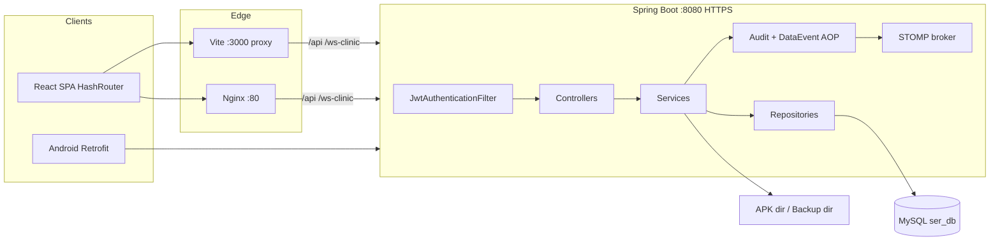

# Architecture

Source of truth: `pom.xml`, `ServicemgmtApplication.java`, `securityConfig/`, `src/main/resources/ui/`.

## Runtime view



### How the browser reaches the API

| Mode | What happens |
|---|---|
| `npm run dev` | Vite serves UI on port 3000. `vite.config.ts` proxies `/api` and `/ws-clinic` to `VITE_DEV_PROXY_TARGET` or `http://localhost:8080` (`secure: false`). Axios `BASE_URL` is `/api`. |
| Maven-built WAR | Frontend is copied to Spring static resources. Browser talks to `https://host:8080`. CORS origins come from `app.cors.allowed-origins`. |
| Nginx (`deploy/nginx.conf`) | Browser uses port 80 same-origin. Nginx proxies `/api/` and `/ws-clinic/` to `127.0.0.1:8080`. `VITE_BACKEND_PORT=80` in `.env.standalone`. |

## Backend layers

Feature code is grouped by domain package (`saleoptions`, `purchaseoptions`, …), not by a single `controller/` / `service/` root.

| Layer | Responsibility |
|---|---|
| `*Controller` | HTTP mapping under `/api/v1/…`, wrap `ApiResponse<T>`, apply `@PreAuthorize` (most controllers). |
| `*Service` | `@Transactional` business rules. Many services **repeat** `@PreAuthorize`. Some modules (Customer, Staff, Warehouse) have **no** controller annotation and rely on the service. |
| `*Repository` | Spring Data JPA. |
| `*model` | JPA `@Entity`. Schema is also adjusted by `config/*SchemaMigration` CommandLineRunners. |
| `*dto` + `*mapper` | MapStruct / manual mapping to JSON. |
| `jwt/` + `securityConfig/` | Filter chain, CORS, JWT parse, `UserDetails`. |
| `exceptionhandler/` | `GlobalExceptionHandler` maps exceptions to HTTP status + JSON. |
| AOP | `auditoptions` logs mutating actions; `dataevent/DataEventAspect` broadcasts `/topic/data-events` after service methods whose names look like create/update/delete/pay. |

`ServicemgmtApplication` enables scheduling and caching.

```mermaid
flowchart TB
  Req[HTTP request]
  Sec[SecurityFilterChain]
  JWT[JwtAuthenticationFilter]
  Ctrl[Controller]
  Pre[@PreAuthorize]
  Svc[Service]
  Tx[@Transactional]
  Repo[Repository]
  JPA[Hibernate / MySQL]

  Req --> Sec --> JWT --> Ctrl --> Pre --> Svc --> Tx --> Repo --> JPA
```

## Frontend architecture

Location: `src/main/resources/ui/`.

| Piece | Role |
|---|---|
| `App.tsx` | `HashRouter`, login restore, route `guard()` using `user.permissions` (`ADMINISTRATOR` bypasses UI checks). |
| `components/Layout.tsx` | Sidebar filtered by the same permission list. |
| `pages/` | One management page per module (~50 pages). |
| `services/api.ts` | Shared Axios instance, in-memory access token, 401 refresh attempt, domain API helpers. |
| `services/*apiservice.ts` | Extra API wrappers. |
| `print/` | Client print helpers; PDF also generated on the server. |
| `hooks/useWebsocket.ts` | STOMP/SockJS to `/ws-clinic`. |

Access token is kept in a JS variable (`setAccessToken`). Refresh token is stored in `sessionStorage` (`sspd_refresh`). Frontend calls `POST /v1/auth/refresh` — **that endpoint is not implemented on the backend** (see findings).

## WebSocket

`WebSocketConfig`:

- `/ws-clinic` — SockJS (browser)
- `/ws-native` — native WebSocket (Android)
- Simple broker prefix `/topic`
- App prefix `/app`

Known topics from code: `/topic/chat`, `/topic/data-events`, `/topic/sales`, `/topic/purchase`, `/topic/service-jobs`, `/topic/role`, `/topic/customer`, `/topic/barcode-scan`, booking alerts, and others matching module names.

STOMP endpoints are `permitAll` in `SecurityConfig`. **Unknown / Needs Confirmation:** whether production should require a token on the WebSocket handshake.

## Cross-cutting

| Concern | Implementation |
|---|---|
| Auth | JWT Bearer on `/api/**` except listed public matchers |
| Audit | AOP around mutating services |
| Realtime UI refresh | `DataEventAspect` → `/topic/data-events` |
| Caching | Hibernate L2 + query cache (Caffeine JCache) |
| Seed data | `PermissionSeeder` → `RoleSeeder` → `UserSeeder`, plus COA/unit seeders |
| Schema extras | `SaleSchemaMigration`, `PurchaseSchemaMigration`, `ServiceSchemaMigration` |

## Adjacent clients (not required for web)

- `android-app/` — Kotlin + Compose + Retrofit, base URL `/api/v1/`
- `mobile-app/` — older React Native tree

## Documentation findings (architecture)

- Root README previously listed `/api/sales`; controllers use `/api/v1/sales`.
- Packaging is `war` with no `SpringBootServletInitializer` in source. Embedded `spring-boot:run` / executable JAR-from-plugin is what local docs assume. External Tomcat deploy is **Needs Confirmation**.
