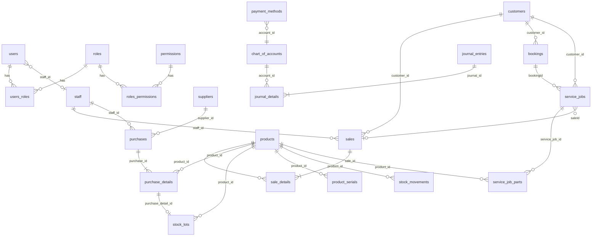

# Database

Source: JPA `@Entity` classes under `src/main/java/org/sspd/servicemgmt/**/model` (plus `printingoptions/entity/VoucherSetting.java`).

- Database name from JDBC URL: **`ser_db`**
- Engine/driver: MySQL connector; Hibernate dialect `MariaDBDialect`
- Schema updates: `spring.jpa.hibernate.ddl-auto=update` **and** CommandLineRunner migrations (`SaleSchemaMigration`, `PurchaseSchemaMigration`, `ServiceSchemaMigration`)
- Join tables defined in annotations: `users_roles`, `roles_permissions`
- Collection table: `mfg_order_item_serials`

Column lists below are **important fields from Java models**, not a dump of every generated Hibernate column. If a field is missing from the entity, it is omitted.

IDs are typically `@GeneratedValue(IDENTITY)` (`Integer` or `Long` as in the entity).

---

## Core ER (sales, stock, service, accounting)

`service_jobs.booking_id` and `service_jobs.sale_id` are stored as columns on `ServiceJob` (not always JPA `@ManyToOne` to Booking/Sale). Confirm in `ServiceJob.java` when changing those links.

---

## RBAC

### `users` — `User`

Purpose: login identity.  
PK: `id` (Long). Unique: `email`.  
Important: `username`, `password` (column `password_hash`), `is_active`, `token_version`, `name`, `phone`, `auth_provider`, `provider_id`, `created_at`.  
FK: `staff_id` → `staff`.  
M2M: `users_roles` (`user_id`, `role_id`).

### `roles` — `Role`

PK: `id` (Integer). Unique: `name`.  
M2M: `roles_permissions`.

### `permissions` — `Permission`

PK: `id` (Long). Unique: `name` (length 50).  
`name` matches `PermissionName` enum (seeded).

---

## People and CRM

### `staff` — `Staff`

PK: `id`. Shop employees; optional link from `users.staff_id`.

### `customer` — `Customer`

PK: `id`. Unique phone is enforced in `CustomerService`, not only by a documented unique column here.  
Credit fields used in sales/jobs: `creditHold`, `creditHoldReason`, `blacklisted`, `blacklistReason` (exact column names in entity).

### `suppliers` — `Supplier`

PK: `id`. Used by purchases, POs, returns, supplier payments.

### Credit tables

| Table | Entity | Purpose | FKs |
|---|---|---|---|
| `customer_credit_terms` | `CustomerCreditTerm` | Terms per customer | `customer_id` |
| `customer_credit_term_history` | `CustomerCreditTermHistory` | History | `customer_id` |
| `customer_payments` | `CustomerPayment` | Customer receipts | `customer_id`, optional `sale_id`, `payment_method_id`, `staff_id` |
| `customer_payment_allocations` | `CustomerPaymentAllocation` | Split onto sales | payment + sale |
| `customer_credit_applications` | `CustomerCreditApplication` | Credit applied to sale | `customer_id`, `sale_id` |
| `credit_alerts` | `CreditAlert` | Overdue / limit alerts | `customer_id`, optional `sale_id` |
| `credit_override_log` | `CreditOverrideLog` | Manager override log | (see entity) |

---

## Catalog / inventory

| Table | Entity | Purpose | Important FKs / notes |
|---|---|---|---|
| `brands` | `Brand` | Brand master | PK `id` |
| `categories` | `Category` | Tree via `parent_id` | self-FK `parent_id` |
| `units` | `Unit` | UOM | PK `id` |
| `products` | `Product` | SKU, stock, serial flag, warranty months/terms | `category_id`, `brand_id`, `unit_id`; `stock_qty`; `has_serial` |
| `product_serials` | `ProductSerial` | Serial + warranty dates + status | `product_id` NOT NULL |
| `shelf_locations` | `ShelfLocation` | Job shelf | PK `id` |
| `warehouses` | `Warehouse` | Warehouse master | PK `id` |
| `warehouse_transfers` | `WarehouseTransfer` | Transfer header | product, `from_warehouse_id`, `to_warehouse_id` |
| `stock_lots` | `StockLot` | Lot per purchase line (FEFO) | `product_id`; **unique** `purchase_detail_id` |
| `sale_lot_allocations` | `SaleLotAllocation` | Sale consumption of lots | sale/lot (see entity) |
| `sale_return_lot_allocations` | `SaleReturnLotAllocation` | Return restore to lots | |
| `stock_movements` | `StockMovement` | Ledger `IN/OUT/RETURN/ADJUST` | `product_id`; `referenceType`, `referenceId` |
| `stock_adjustments` | `StockAdjustment` | Damage/loss/found/correction | product, staff |
| `manufacturing_formulas` | `ManufacturingFormula` | BOM header | |
| `manufacturing_formula_items` | `ManufacturingFormulaItem` | BOM lines | `formula_id` |
| `manufacturing_orders` | `ManufacturingOrder` | Production order | |
| `manufacturing_order_items` | `ManufacturingOrderItem` | Order lines + serial collection table | `order_id` |

`Product` also has a `@OneToMany` of serials.

---

## Sales

| Table | Entity | Purpose | FKs / constraints |
|---|---|---|---|
| `sales` | `Sale` | Invoice header | unique `sale_code`; `customer_id` NOT NULL; `staff_id` nullable; indexes on date, customer, payment_status, code |
| `sale_details` | `SaleDetail` | Lines | `sale_id`, `product_id` NOT NULL; warranty months/expiry |
| `sale_returns` | `SaleReturn` | Return header | `sale_id` NOT NULL; `staff_id`; `payment_method_id` |
| `sale_return_details` | `SaleReturnDetail` | Return lines | `return_id`, `product_id`; optional `reason_id` |
| `sale_return_reasons` | `SaleReturnReason` | Reason master | |
| `quotations` | `Quotation` | Quote header | `customer_id` NOT NULL |
| `quotation_details` | `QuotationDetail` | Quote lines | quotation |
| `cash_drawer_sessions` | `CashDrawerSession` | Drawer session | |
| `cash_drawer_movements` | `CashDrawerMovement` | Cash in/out | `session_id` |

`Sale` void fields: `voided`, `voidReason`, `voidedBy`, `voidedAt` (see entity).

---

## Purchases

| Table | Entity | Purpose | FKs / notes |
|---|---|---|---|
| `purchases` | `Purchase` | Voucher header (DRAFT/CONFIRMED/CANCELLED) | `supplier_id`, `staff_id` NOT NULL |
| `purchase_details` | `PurchaseDetail` | Lines | `purchase_id`, `product_id` |
| `purchase_detail_warranties` | `PurchaseDetailWarranty` | Per-item warranty/serial on a line | `purchase_detail_id` |
| `purchase_orders` | `PurchaseOrder` | PO header | supplier/staff (see entity) |
| `purchase_order_details` | `PurchaseOrderDetail` | PO lines | |
| `goods_receipts` | `GoodsReceipt` | Receipt header | `purchase_order_id` NOT NULL |
| `goods_receipt_lines` | `GoodsReceiptLine` | Receipt lines | `goods_receipt_id` |
| `purchase_returns` | `PurchaseReturn` | Return header | optional `purchase_id` |
| `purchase_return_details` | `PurchaseReturnDetail` | Return lines | `return_id`, `product_id` |
| `purchase_return_activities` | `PurchaseReturnActivity` | Status audit | `purchase_return_id` |
| `purchase_return_attachments` | `PurchaseReturnAttachment` | Images as LONGTEXT dataUrl | `purchase_return_id` |
| `purchase_return_reasons` | `PurchaseReturnReason` | Reason master | |
| `purchase_budgets` | `PurchaseBudget` | Budget | optional `category_id`, `supplier_id` |
| `supplier_payments` | `SupplierPayment` | AP payment | supplier, payment_method |
| `supplier_payment_allocations` | `SupplierPaymentAllocation` | Onto purchases | payment, purchase |
| `supplier_credit_applications` | `SupplierCreditApplication` | Credit onto purchase | supplier, `targetPurchase` |

---

## Bookings and service jobs

| Table | Entity | Purpose | FKs |
|---|---|---|---|
| `service_type` | `ServiceType` | Catalog type | |
| `sub_service_type` | `SubServiceType` | Subtype | type |
| `services` | `ServiceItem` | Priced service | `service_type_id` NOT NULL; optional `sub_service_type_id`; `warranty_months` |
| `service_item_price_history` | `ServiceItemPriceHistory` | Price history | `service_item_id` |
| `bookings` | `Booking` | Intake | `customer_id` NOT NULL; optional staff, payment_method |
| `booking_details` | `BookingDetail` | Services on booking | `booking_id`, `service_id` |
| `booking_devices` | `BookingDevice` | Device | `booking_id` |
| `booking_device_infos` | `BookingDeviceInfo` | Extra device info | `booking_id` |
| `booking_attachments` | `BookingAttachment` | Photos (dataUrl) | `booking_id` |
| `service_jobs` | `ServiceJob` | Repair job | `customer_id`; `assigned_staff_id`; `helper_staff_id`; `shelf_location_id`; `payment_method_id`; `bookingId`/`saleId` columns |
| `service_job_lines` | `ServiceJobLine` | Labour/service lines | job |
| `service_job_parts` | `ServiceJobPart` | Parts | `service_job_id`, `product_id` |
| `service_job_attachments` | `ServiceJobAttachment` | Photos | `service_job_id` |
| `service_job_activities` | `ServiceJobActivity` | Timeline | `service_job_id` |
| `service_job_notifications` | `ServiceJobNotification` | Notify log | |
| `rework_part_resolutions` | `ReworkPartResolution` | Rework parts | |

---

## Accounting

| Table | Entity | Purpose | FKs |
|---|---|---|---|
| `chart_of_accounts` | `ChartOfAccount` | COA tree | `parent_id` |
| `journal_entries` | `JournalEntry` | Header | optional `staff_id` |
| `journal_details` | `JournalDetail` | Lines (debit/credit) | `journal_id`, `account_id` NOT NULL |
| `payment_methods` | `PaymentMethod` | Till/bank | `account_id` NOT NULL |
| `payment_transactions` | `PaymentTransaction` | Cash/bank movements + `ReferenceType` | |
| `account_balances` | `AccountBalance` | Opening/balances | account |
| `expenses` | `Expense` | Expense voucher | `account_id`, `payment_method_id`, `staff_id` NOT NULL |
| `incomes` | `Income` | Income voucher | same pattern as expense |
| `accounting_period_locks` | `AccountingPeriodLock` | Closed periods | |

---

## Ops / settings

| Table | Entity | Purpose |
|---|---|---|
| `company_settings` | `CompanySettings` | Shop profile for receipts |
| `app_version_settings` | `AppVersionSettings` | POS and technician APK version metadata |
| `barcode_label_settings` | `BarcodeLabelSettings` | Label defaults |
| `barcode_label_preset` | `BarcodeLabelPreset` | Saved layouts |
| `voucher_settings` | `VoucherSetting` | Print templates; unique `document_type` |
| `audit_logs` | `AuditLog` | AOP audit |
| `chat_messages` | `ChatMessage` | Chat history |
| `backup_settings` | `BackupSettings` | Schedule + mysqldump path + keepDays |
| `backup_history` | `BackupHistory` | Each run (SUCCESS/FAILED/RUNNING) |

---

## Seed / bootstrap

On empty (or matching) DB, CommandLineRunners insert:

- All `PermissionName` rows
- Roles in `RoleName` (`ADMINISTRATOR`, `ADMIN`, `CASHIER`, `TECHNICIAN`, `PURCHASER`)
- Default LOCAL user if the seeder email is absent
- COA / units (see `CoaSeeder`, `UnitSeeder`)

`ADMINISTRATOR.permissions` is reset to **all** permissions every boot (`RoleSeeder`).

---

## Documentation findings (database)

- `ddl-auto=update` is used in the checked-in properties. Production schema-ownership process is **Needs Confirmation**.
- Some relationships are integer columns (`bookingId`, `saleId` on jobs) rather than JPA associations.
- Attachments are often `@Lob` LONGTEXT data URLs, not filesystem blobs (except APK files and SQL backups).
