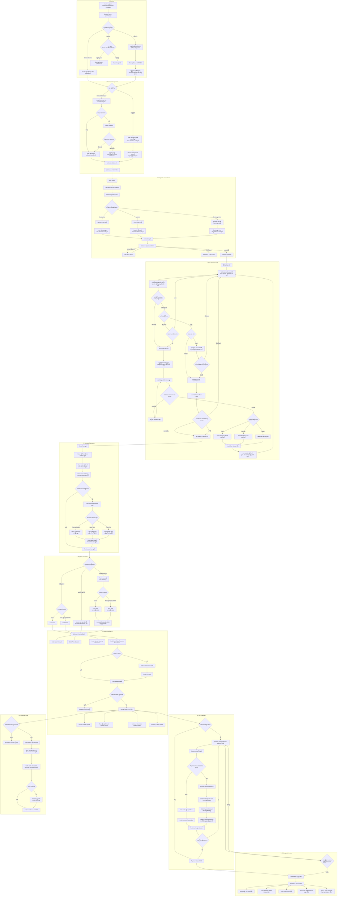

```mermaid
flowchart TD

subgraph Booking["1. Booking"]
    A["Booking ဖန်တီး<br/>Customer, Appointment, Complaint"] --> B["Booking Status: CONFIRMED"]
    B --> C{"လုပ်ဆောင်ချက်ရွေး"}

    C -->|"Outdoor Service"| D["OUTDOOR Service Job တစ်ခုဖန်တီး"]
    C -->|"ဆိုင်အပ်"| E["ပစ္စည်းတစ်ခု သို့မဟုတ်<br/>တစ်ခုထက်ပို လက်ခံ"]
    E --> F["Booking Status: ARRIVED"]
    F --> G["ပစ္စည်းတစ်ခုစီအတွက်<br/>INDOOR Service Job တစ်ခုဖန်တီး"]

    C -->|"Cancel"| H{"Service Job ချိတ်ပြီးပြီလား"}
    H -->|"မချိတ်ရသေး"| I["Booking Status: CANCELED"]
    H -->|"ချိတ်ပြီး"| J["Cancel မလုပ်နိုင်"]
end

D --> K
G --> K

subgraph Assignment["2. Technician Assignment"]
    K{"လုပ်ငန်းပုံစံရွေး"}

    K -->|"တစ်ယောက်တာဝန်ယူ"| L["Lead Technician တစ်ယောက်သတ်မှတ်"]
    K -->|"အဖွဲ့လိုက်"| M["Lead Technician တစ်ယောက်နှင့်<br/>Team Members သတ်မှတ်"]

    L --> N{"Helper လိုသလား"}
    N -->|"မလို"| O["Lead Technician တစ်ယောက်တည်းလုပ်"]
    N -->|"လို"| P["Helper Request"]
    P --> Q{"Supervisor Approval"}
    Q -->|"အတည်ပြု"| R["Helper ထည့်<br/>တာဝန်ပိုင်ရှင်က Lead Technician"]
    Q -->|"ငြင်းပယ်"| O

    M --> S["Member တစ်ယောက်စီအတွက်<br/>လုပ်ငန်းခွဲ သတ်မှတ်"]

    O --> T["Technician Job လက်ခံ"]
    R --> T
    S --> T
    T --> U["Job Status: ASSIGNED"]
end

subgraph Diagnosis["3. Diagnosis and Estimate"]
    U --> V["Work Started"]
    V --> W["Job Status: IN PROGRESS"]
    W --> X["Diagnosis မှတ်တမ်းတင်"]
    X --> Y{"လိုအပ်သည့်အမျိုးအစား"}

    Y -->|"Service သာ"| Z["Service Lines ထည့်"]
    Y -->|"Parts သာ"| AA["Parts Lines ထည့်"]
    Y -->|"Service နှင့် Parts"| AB["Service Lines နှင့်<br/>Parts Lines ထည့်"]

    Z --> AC["Price, Quantity နှင့်<br/>Line Discount သတ်မှတ်"]
    AA --> AD["Quantity သို့မဟုတ်<br/>Serial Number သတ်မှတ်"]
    AB --> AE["Service နှင့် Parts<br/>အချက်အလက်သတ်မှတ်"]

    AC --> AF["Estimate တွက်"]
    AD --> AF
    AE --> AF

    AF --> AG["Customer Approval တောင်း"]
    AG -->|"အတည်မပြုသေး"| AH["Job Status: HOLD"]
    AH --> AG
    AG -->|"မလုပ်တော့"| AI["Job Status: CANCELED"]
    AG -->|"အတည်ပြု"| AJ["Estimate Approved"]
end

subgraph Work["4. Work and Hand Over"]
    AJ --> AK["ပြင်ဆင်မှုစတင်"]
    AK --> AL["Technician တစ်ယောက်စီ<br/>Start, Pause, Resume Log တင်"]
    AL --> AM["လုပ်ပြီးသောအလုပ်၊ အချိန်၊<br/>Service နှင့် Parts မှတ်တမ်းတင်"]

    AM --> AN{"လက်ရှိ Technician<br/>ဆက်လုပ်နိုင်သလား"}

    AN -->|"ဆက်လုပ်နိုင်"| AO{"လုပ်ငန်းပြီးပြီလား"}
    AN -->|"မဆက်နိုင်"| AP["Hand Over Request"]

    AP --> AQ["လုပ်ပြီးသောအလုပ်နှင့်<br/>ကျန်ရှိသောအလုပ် မှတ်တမ်းတင်"]
    AQ --> AR["လက်ခံမည့် Technician ရွေး"]
    AR --> AS{"Technician အသစ်လက်ခံသလား"}

    AS -->|"မလက်ခံ"| AT["အခြား Technician ရွေး"]
    AT --> AR

    AS -->|"လက်ခံ"| AU{"လွှဲပြောင်းမည့် Role"}
    AU -->|"Lead"| AV["Lead Technician အသစ်သတ်မှတ်"]
    AU -->|"Member"| AW["Team Member အသစ်သတ်မှတ်"]
    AU -->|"Helper"| AX["Helper အသစ်သတ်မှတ်"]

    AV --> AY["Hand Over History သိမ်း"]
    AW --> AY
    AX --> AY

    AY --> AZ["Job အသစ်မဖန်တီးဘဲ<br/>မူလ Job Number ဖြင့်ဆက်လုပ်"]
    AZ --> AL

    AO -->|"မပြီးသေး"| BA{"Hand Over လိုသလား"}
    BA -->|"လို"| AP
    BA -->|"မလို"| AL

    AO -->|"ပြီးပြီ"| BB{"Team Job လား"}
    BB -->|"မဟုတ်"| BC["Lead Technician Completion တင်"]
    BB -->|"ဟုတ်"| BD["Members တစ်ယောက်စီ<br/>လုပ်ငန်းခွဲ Completed တင်"]

    BD --> BE{"လုပ်ငန်းခွဲအားလုံးပြီးပြီလား"}
    BE -->|"မပြီးသေး"| AL
    BE -->|"ပြီးပြီ"| BC

    BC --> BF["Lead Technician Final Check"]
    BF --> BG{"Supervisor Approval လိုသလား"}
    BG -->|"ပြန်ပြင်ရန်"| AL
    BG -->|"အတည်ပြု"| BH["Job Status: COMPLETED"]
    BG -->|"မလို"| BH
end

subgraph Discount["5. Discount Calculation"]
    BH --> BI["Settle Form ဖွင့်"]
    BI --> BJ["Labor နှင့် Parts Gross Amount တွက်"]
    BJ --> BK["Row တစ်ခုချင်းစီ၏<br/>Line Discount နှုတ်"]
    BK --> BL["Labor Net Subtotal နှင့်<br/>Parts Net Subtotal တွက်"]
    BL --> BM{"Overall Discount ရှိသလား"}

    BM -->|"မရှိ"| BN["Final Invoice Net တွက်"]
    BM -->|"ရှိ"| BO["Overall Discount Amount ထည့်"]
    BO --> BP{"Allocation Method ရွေး"}

    BP -->|"Pro-rata Default"| BQ["Labor နှင့် Parts ကို<br/>အချိုးကျခွဲ"]
    BP -->|"Labor First"| BR["Labor မှအရင်နှုတ်<br/>ကျန်မှ Parts မှနှုတ်"]
    BP -->|"Parts First"| BS["Parts မှအရင်နှုတ်<br/>ကျန်မှ Labor မှနှုတ်"]

    BQ --> BT["Final Labor Net နှင့်<br/>Final Parts Net တွက်"]
    BR --> BT
    BS --> BT
    BT --> BN
end

subgraph Payment["6. Payment and Credit"]
    BN --> BU{"Payment အခြေအနေ"}

    BU -->|"အပြည့်ပေး"| BV{"Payment Method"}
    BU -->|"တစ်စိတ်တစ်ပိုင်း"| BW["Paid Amount နှင့်<br/>Due Amount ခွဲ"]
    BU -->|"အကြွေးအပြည့်"| BX["Invoice Net အားလုံးကို<br/>Accounts Receivable တင်"]

    BV -->|"Cash"| BY["Cash Debit"]
    BV -->|"Bank သို့မဟုတ် Mobile"| BZ["Bank Debit"]

    BW --> CA{"Payment Method"}
    CA -->|"Cash"| CB["Cash Debit<br/>ပေးသည့်ပမာဏ"]
    CA -->|"Bank သို့မဟုတ် Mobile"| CC["Bank Debit<br/>ပေးသည့်ပမာဏ"]

    CB --> CD["Accounts Receivable Debit<br/>ကျန်ငွေပမာဏ"]
    CC --> CD
end

subgraph Accounting["7. Accounting Journal"]
    BY --> CE["Settlement Journal Batch"]
    BZ --> CE
    BX --> CE
    CD --> CE

    CE --> CF["Debit Labor Discount"]
    CE --> CG["Debit Parts Discount"]
    CE --> CH["Credit Service Revenue<br/>Labor Gross"]
    CE --> CI["Credit Parts Sales Revenue<br/>Parts Gross"]

    CI --> CJ{"Parts ပါသလား"}
    CJ -->|"မပါ"| CK["Journal Balance စစ်"]
    CJ -->|"ပါ"| CL["Debit Cost of Goods Sold"]
    CL --> CM["Credit Inventory"]
    CM --> CK

    CK --> CN{"Debit နှင့် Credit ညီသလား"}
    CN -->|"မညီ"| CO["Settle မလုပ်ဘဲ Error ပြ"]
    CN -->|"ညီ"| CP["Journal Status: POSTED"]

    CP --> CQ["General Ledger Update"]
    CP --> CR["Cash သို့မဟုတ် Bank Ledger Update"]
    CP --> CS["Customer Receivable Ledger Update"]
    CP --> CT["Inventory Ledger Update"]
end

subgraph Collection["8. Due Collection"]
    CP --> CU{"Due Amount ရှိသလား"}
    CU -->|"မရှိ"| CV["Payment Status: PAID"]
    CU -->|"ရှိ"| CW["Payment Status: PARTIAL သို့မဟုတ် DUE"]

    CW --> CX["Customer အကြွေးဆပ်"]
    CX --> CY{"Payment Discount ထပ်ပေးသလား"}

    CY -->|"မပေး"| CZ["Debit Cash သို့မဟုတ် Bank"]
    CZ --> DA["Credit Accounts Receivable"]

    CY -->|"ပေး"| DB["Payment Discount Approval"]
    DB --> DC["Debit Cash သို့မဟုတ် Bank<br/>တကယ်ရသောငွေ"]
    DC --> DD["Debit Payment Discount<br/>ထပ်လျှော့သောငွေ"]
    DD --> DE["Credit Accounts Receivable<br/>အကြွေးလျှော့သည့်စုစုပေါင်း"]

    DA --> DF["Customer Ledger Update"]
    DE --> DF
    DF --> DG{"အကြွေးကျန်သေးလား"}
    DG -->|"ရှိ"| CW
    DG -->|"မရှိ"| CV
end

subgraph Delivery["9. Delivery and History"]
    CV --> DH["Customer ထံ ပစ္စည်းအပ်"]
    CW --> DI{"Due ရှိစဉ် Delivery<br/>ခွင့်ပြုထားသလား"}
    DI -->|"ခွင့်မပြု"| CW
    DI -->|"ခွင့်ပြု"| DH

    DH --> DJ["Job Status: DELIVERED"]
    DJ --> DK["Booking နှင့် Job Link သိမ်း"]
    DJ --> DL["Lead, Member, Helper History သိမ်း"]
    DJ --> DM["Hand Over History သိမ်း"]
    DJ --> DN["Technician Time and Work Logs သိမ်း"]
    DJ --> DO["Service, Parts, Discount,<br/>Payment History သိမ်း"]
end

subgraph Void["10. Settlement Void"]
    CP --> DP{"Settlement Void လုပ်သလား"}
    DP -->|"မလုပ်"| DQ["Accounting Process ပြီးဆုံး"]
    DP -->|"လုပ်"| DR["Void Reason နှင့် Approval"]
    DR --> DS["မူလ Journal မဖျက်ဘဲ<br/>Reversal Journal ဖန်တီး"]
    DS --> DT["Cash, Bank, Receivable,<br/>Revenue, Discount Reverse"]
    DT --> DU{"Parts ပါသလား"}
    DU -->|"ပါ"| DV["Inventory ပြန်တင်<br/>COGS Reverse"]
    DU -->|"မပါ"| DW["Settlement Status: VOIDED"]
    DV --> DW
end
```